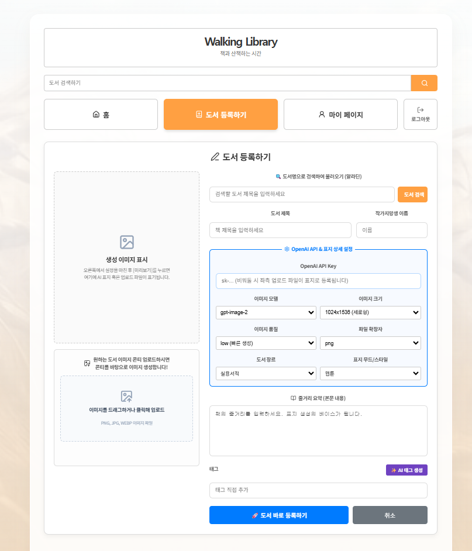
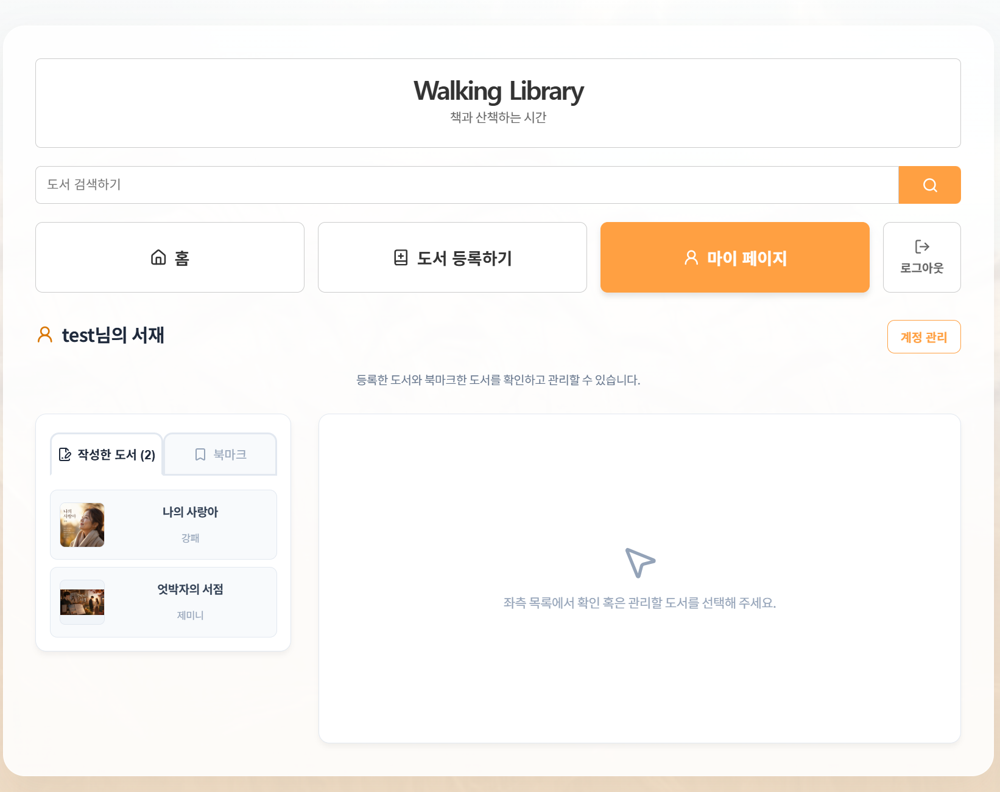
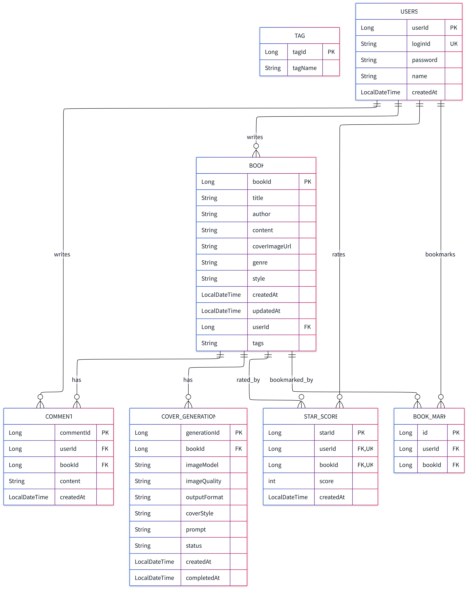

# BookApp Backend README

## 개요

BookApp 백엔드는 사용자가 책을 등록하고, 책 표지 이미지를 업로드하며, 댓글, 별점, 북마크, 태그를 관리할 수 있도록 지원하는 Spring Boot 기반 REST API 서버입니다.

주요 기능은 다음과 같습니다.

- 사용자 회원가입, 로그인, 회원 정보 조회/수정/삭제
- 책 등록, 조회, 수정, 삭제
- 사용자별 책 목록 조회 및 태그 기반 책 검색
- 책 표지 이미지 업로드 및 정적 파일 제공
- 댓글 등록, 책별 댓글 조회, 댓글 삭제
- 별점 등록/수정 및 책별 평균 별점 조회
- 북마크 토글, 북마크 여부 확인, 사용자별 북마크 책 조회
- 태그 등록, 조회, 검색, 삭제

## 기술 스택

| 구분 | 기술                      |
| --- |-------------------------|
| Language | Java 17                 |
| Framework | Spring Boot 3           |
| Build Tool | Gradle                  |
| Web | Spring Web MVC          |
| ORM | Spring Data JPA         |
| Database | H2 In-Memory Database   |
| Security | Spring Security, BCrypt |
| Validation | Jakarta Bean Validation |
| Utility | Lombok                  |

## 실행 방법

### 1. 백엔드 폴더로 이동

```bash
cd bookapp
```

### 2. 애플리케이션 실행

Windows 환경:

```bash
.\gradlew.bat bootRun
```


### 3. 접속 정보

- API 서버: `http://localhost:8080`
- H2 Console: `http://localhost:8080/h2-console`
- 업로드 이미지 경로: `http://localhost:8080/uploads/covers/{fileName}`


## API 명세


| 구분 | 서비스(메뉴) | API 이름 | Method | REST API | 입력데이터 | 반환데이터 | 오류데이터 | 기능설명 | 비고 |
| --- | --- | --- | --- | --- | --- | --- | --- | --- | --- |
| Common | User | 회원가입 | `POST` | `/users` | Body<br>`{`<br>`"loginId": "String",`<br>`"password": "String",`<br>`"name": "String"`<br>`}` | code: 201<br>`{`<br>`"userId": 1,`<br>`"loginId": "user01",`<br>`"name": "홍길동",`<br>`"createdAt": "2026-06-10T15:00:00"`<br>`}` | 중복 아이디<br>code: 409<br>`{`<br>`"timestamp": "...",`<br>`"status": 409,`<br>`"error": "Conflict",`<br>`"path": "/users"`<br>`}`<br>reason: Already registered loginId.<br><br>입력값 검증 실패<br>code: 400<br>`{`<br>`"error": "Validation failed",`<br>`"message": "must not be blank"`<br>`}` | 아이디(loginId), 비밀번호, 이름을 입력하여 회원가입한다. 비밀번호는 BCrypt로 암호화되어 저장된다. |  |
| Common | User | 회원 목록/아이디 검색 | `GET` | `/users`<br>`/users?loginId={loginId}` | Query(optional)<br>`loginId: String` | code: 200<br>`[`<br>`{`<br>`"userId": 1,`<br>`"loginId": "user01",`<br>`"name": "홍길동",`<br>`"createdAt": "2026-06-10T15:00:00"`<br>`}`<br>`]` | 내부 서버 오류<br>code: 500<br>`{`<br>`"timestamp": "...",`<br>`"status": 500,`<br>`"error": "Internal Server Error",`<br>`"path": "/users"`<br>`}` | loginId가 없으면 전체 회원 목록을 조회하고, loginId가 있으면 해당 아이디 회원 목록을 조회한다. 프론트 회원가입 중복 체크에서 사용한다. |  |
|  | Login | 로그인 | `POST` | `/users/login` | Body<br>`{`<br>`"loginId": "String",`<br>`"password": "String"`<br>`}` | code: 200<br>`{`<br>`"userId": 1,`<br>`"loginId": "user01",`<br>`"name": "홍길동",`<br>`"createdAt": "2026-06-10T15:00:00"`<br>`}` | 아이디 또는 비밀번호 불일치<br>code: 401<br>`{`<br>`"timestamp": "...",`<br>`"status": 401,`<br>`"error": "Unauthorized",`<br>`"path": "/users/login"`<br>`}`<br>reason: Invalid loginId or password.<br><br>입력값 검증 실패<br>code: 400<br>`{`<br>`"error": "Validation failed",`<br>`"message": "must not be blank"`<br>`}` | loginId와 password를 검증하여 로그인한다. 현재 JWT/세션 토큰은 반환하지 않고 사용자 정보만 반환한다. |  |
|  | User | 회원 상세 조회 | `GET` | `/users/{userId}` | Path<br>`userId: String(Long 형식)` | code: 200<br>`{`<br>`"userId": 1,`<br>`"loginId": "user01",`<br>`"name": "홍길동",`<br>`"createdAt": "2026-06-10T15:00:00"`<br>`}` | 사용자 없음<br>code: 404<br>`{`<br>`"timestamp": "...",`<br>`"status": 404,`<br>`"error": "Not Found",`<br>`"path": "/users/{userId}"`<br>`}`<br>reason: User not found: {userId}<br><br>userId 숫자 변환 실패<br>code: 500 | userId로 회원 프로필 정보를 조회한다. |  |
|  | User | 회원 정보 수정 | `PATCH` | `/users/{userId}` | Path<br>`userId: String(Long 형식)`<br><br>Body<br>`{`<br>`"password": "String",`<br>`"name": "String"`<br>`}` | code: 200<br>`{`<br>`"userId": 1,`<br>`"loginId": "user01",`<br>`"name": "김유진",`<br>`"createdAt": "2026-06-10T15:00:00"`<br>`}` | 사용자 없음<br>code: 404<br>`{`<br>`"timestamp": "...",`<br>`"status": 404,`<br>`"error": "Not Found",`<br>`"path": "/users/{userId}"`<br>`}`<br>reason: User not found: {userId}<br><br>userId 숫자 변환 실패<br>code: 500 | 회원 이름과 비밀번호를 수정한다. 빈 문자열 또는 null 필드는 기존 값을 유지한다. 비밀번호가 변경되면 BCrypt로 암호화되어 저장된다. |  |
|  | User | 회원 탈퇴 | `DELETE` | `/users/{userId}` | Path<br>`userId: String(Long 형식)` | code: 204<br>No Content | 존재하지 않는 userId 또는 내부 오류<br>code: 500<br>`{`<br>`"timestamp": "...",`<br>`"status": 500,`<br>`"error": "Internal Server Error",`<br>`"path": "/users/{userId}"`<br>`}` | userId에 해당하는 회원을 삭제한다. |  |
| Book | Book | 도서 등록 | `POST` | `/books` | Body<br>`{`<br>`"title": "String",`<br>`"author": "String",`<br>`"content": "String",`<br>`"coverImageUrl": "String",`<br>`"userId": 1`<br>`}` | code: 201<br>`{`<br>`"id": 1,`<br>`"title": "책 제목",`<br>`"author": "저자",`<br>`"content": "내용",`<br>`"coverImageUrl": "data:image/png;base64,...",`<br>`"createdAt": "2026-06-10T15:00:00",`<br>`"updatedAt": "2026-06-10T15:00:00",`<br>`"userId": 1`<br>`}` | 입력값 검증 실패<br>code: 400<br>`{`<br>`"error": "Validation failed",`<br>`"message": "must not be blank"`<br>`}`<br><br>내부 서버 오류<br>code: 500 | 도서 제목, 저자, 내용, 표지 이미지 URL/Base64, 작성자 userId를 저장한다. title/author/content는 필수이다. |  |
|  | Book | 전체 도서 목록 조회 | `GET` | `/books` | - | code: 200<br>`[`<br>`{`<br>`"id": 1,`<br>`"title": "책 제목",`<br>`"author": "저자",`<br>`"content": "내용",`<br>`"coverImageUrl": "data:image/png;base64,...",`<br>`"createdAt": "2026-06-10T15:00:00",`<br>`"updatedAt": "2026-06-10T15:00:00",`<br>`"userId": 1`<br>`}`<br>`]` | 내부 서버 오류<br>code: 500 | 등록된 전체 도서 목록을 조회한다. 프론트 홈 화면의 도서 목록과 추천 도서 데이터로 사용한다. |  |
|  | Book | 도서 상세 조회 | `GET` | `/books/{id}` | Path<br>`id: Long` | code: 200<br>`{`<br>`"id": 1,`<br>`"title": "책 제목",`<br>`"author": "저자",`<br>`"content": "내용",`<br>`"coverImageUrl": "data:image/png;base64,...",`<br>`"createdAt": "2026-06-10T15:00:00",`<br>`"updatedAt": "2026-06-10T15:00:00",`<br>`"userId": 1`<br>`}` | 도서 없음<br>code: 404<br>`{`<br>`"error": "Book not found",`<br>`"message": "Book not found: id={id}"`<br>`}`<br><br>id 타입 불일치<br>code: 400 | id에 해당하는 도서 상세 정보를 조회한다. |  |
|  | Book | 회원별 도서 목록 조회 | `GET` | `/books/user/{userId}` | Path<br>`userId: Long` | code: 200<br>`[`<br>`{`<br>`"id": 1,`<br>`"title": "책 제목",`<br>`"author": "저자",`<br>`"content": "내용",`<br>`"coverImageUrl": "data:image/png;base64,...",`<br>`"createdAt": "2026-06-10T15:00:00",`<br>`"updatedAt": "2026-06-10T15:00:00",`<br>`"userId": 1`<br>`}`<br>`]` | userId 타입 불일치<br>code: 400<br><br>내부 서버 오류<br>code: 500 | 특정 userId가 등록한 도서 목록을 조회한다. 현재 서비스 로직에서 전체 도서 조회 후 userId로 필터링한다. |  |
|  | Book | 도서 수정 | `PATCH` | `/books/update/{id}` | Path<br>`id: Long`<br><br>Body<br>`{`<br>`"title": "String",`<br>`"author": "String",`<br>`"content": "String",`<br>`"coverImageUrl": "String",`<br>`"userId": 1`<br>`}` | code: 200<br>`{`<br>`"id": 1,`<br>`"title": "수정된 제목",`<br>`"author": "수정된 저자",`<br>`"content": "수정된 내용",`<br>`"coverImageUrl": "data:image/png;base64,...",`<br>`"createdAt": "2026-06-10T15:00:00",`<br>`"updatedAt": "2026-06-10T15:10:00",`<br>`"userId": 1`<br>`}` | 도서 없음<br>code: 404<br>`{`<br>`"error": "Book not found",`<br>`"message": "Book not found: id={id}"`<br>`}`<br><br>id 타입 불일치<br>code: 400 | id에 해당하는 도서 정보를 수정한다. null이 아닌 title/author/content/coverImageUrl 필드만 반영하며 updatedAt을 갱신한다. |  |
|  | Book | 도서 삭제 | `DELETE` | `/books/{id}` | Path<br>`id: Long` | code: 204<br>No Content | 도서 없음<br>code: 404<br>`{`<br>`"error": "Book not found",`<br>`"message": "Book not found: id={id}"`<br>`}`<br><br>id 타입 불일치<br>code: 400 | id에 해당하는 도서를 삭제한다. |  |
|  | Book | 도서 등록 테스트(URL) | `GET` | `/books/create-test?title={title}&author={author}&content={content}` | Query<br>`title: String`<br>`author: String`<br>`content: String` | code: 201<br>`{`<br>`"id": 1,`<br>`"title": "책 제목",`<br>`"author": "저자",`<br>`"content": "내용",`<br>`"coverImageUrl": null,`<br>`"createdAt": "2026-06-10T15:00:00",`<br>`"updatedAt": "2026-06-10T15:00:00",`<br>`"userId": null`<br>`}` | 필수 query 누락<br>code: 400<br><br>내부 서버 오류<br>code: 500 | 쿼리 파라미터로 테스트 도서를 등록한다. 개발/테스트용 API 성격이다. |  |
| Test | Book | 도서 수정 테스트(URL) | `GET` | `/books/update-url?id={id}&title={title}&author={author}&content={content}&coverImageUrl={coverImageUrl}` | Query<br>`id: Long`<br>`title: String`<br>`author: String`<br>`content: String`<br>`coverImageUrl: String(optional)` | code: 200<br>`{`<br>`"id": 1,`<br>`"title": "수정된 제목",`<br>`"author": "수정된 저자",`<br>`"content": "수정된 내용",`<br>`"coverImageUrl": "https://example.com/cover.png",`<br>`"createdAt": "2026-06-10T15:00:00",`<br>`"updatedAt": "2026-06-10T15:10:00",`<br>`"userId": 1`<br>`}` | 도서 없음<br>code: 404<br>`{`<br>`"error": "Book not found",`<br>`"message": "Book not found: id={id}"`<br>`}`<br><br>필수 query 누락 또는 타입 불일치<br>code: 400 | 쿼리 파라미터로 도서를 수정한다. 개발/테스트용 API 성격이다. |  |
|  | Common | Hello 테스트 | `GET` | `/hello/{name}` | Path<br>`name: String` | code: 200<br>Hello{name}! | 내부 서버 오류<br>code: 500 | 이름을 path로 받아 문자열 인사말을 반환하는 테스트 API이다. |  |
|  | Common | Greeting 테스트 | `GET` | `/greet?lang={lang}` | Query(optional)<br>`lang: String`<br>`default: en` | code: 200<br>lang=ko: 안녕하세요<br>기타: Hello | 내부 서버 오류<br>code: 500 | lang 값에 따라 문자열 인사말을 반환하는 테스트 API이다. 현재 소스의 ko 응답 문자열은 인코딩이 깨져 보일 수 있다. |  |

## R&R

| 이름 | 역할 | 수행 내역 |
| --- | --- | --- |
| 오승헌, 안주현 | PM | ERD / API 정의서 작성, README.md 작성, 발표 자료 준비, 통합 이슈 추적 |
| 조현우 | 백엔드 개발 | Book Entity 작성, BookRepository 구현, H2 콘솔 확인, Lombok 4종 적용 |
| 정민호 | 백엔드 개발 | BookService 클래스 구현, 비즈니스 로직 작성, BookNotFoundException 구현, `@Transactional` 적용 |
| 정영환 | 백엔드 개발 | BookController 구현, 5종 CRUD 엔드포인트 작성, `@Valid` 및 `@NotBlank` 적용, Postman 테스트 |
| 김재성 | 통합 / 예외 처리 | WebConfig 작성, GlobalExceptionHandler 구현, 풀스택 디버깅, 트러블슈팅 정리 |
| 김석주 | AI / Frontend 연동 | Frontend 코드 분석, fetch URL 변경 및 1차 연동, OpenAI 표지 생성 흐름 정리, E2E 시연 준비 |

## 트러블슈팅

### CORS 오류가 발생하는 경우

현재 허용된 프론트엔드 Origin은 다음과 같습니다.

- `http://localhost:5173`
- `http://127.0.0.1:5173`

프론트엔드 실행 포트가 다르면 `WebConfig`의 `allowedOrigins`에 해당 주소를 추가해야 합니다.

### H2 Console 접속은 되지만 테이블이 없는 경우

JDBC URL이 `jdbc:h2:mem:bookdb`인지 확인해야 합니다. H2는 인메모리 DB이므로 애플리케이션이 실행 중일 때만 데이터베이스가 유지됩니다.

### 서버 재시작 후 데이터가 사라지는 경우

현재 DB는 H2 인메모리 방식이고, JPA 설정이 `ddl-auto: create`입니다. 서버가 재시작되면 테이블과 데이터가 새로 생성됩니다. 데이터를 유지하려면 파일 기반 H2 또는 별도 DB로 전환해야 합니다.

### 이미지 업로드가 실패하는 경우

다음 조건을 확인합니다.

- 요청 방식이 `multipart/form-data`인지 확인
- 파일 필드명이 `file`인지 확인
- 파일 타입이 이미지인지 확인
- 확장자가 `png`, `jpg`, `jpeg`, `webp`, `gif` 중 하나인지 확인
- 파일 크기가 `20MB` 이하인지 확인

### 업로드한 이미지가 브라우저에서 보이지 않는 경우

`app.upload.cover-dir` 설정값과 실제 저장 경로를 확인합니다. 현재 기본 저장 경로는 `uploads/covers`이며, 서버는 `/uploads/covers/**` 경로로 해당 폴더를 정적 리소스로 제공합니다.

### 회원가입 시 중복 ID 오류가 발생하는 경우

`loginId`는 unique 제약 조건을 가집니다. 이미 존재하는 `loginId`로 회원가입하면 `409 Conflict`가 반환됩니다.

### 로그인 실패 시 확인할 내용

- 존재하지 않는 `loginId`: `404 Not Found`
- 비밀번호 불일치: `401 Unauthorized`

비밀번호는 회원가입 및 수정 시 BCrypt로 암호화되어 저장됩니다.

## 주요 구현 결과

| 홈 | 도서 등록하기 | 마이 페이지 |
| --- | --- | --- |
|  |  |  |

### 미션 1·2 설계 및 골격



- [Domain] Spring Initializr 기반 프로젝트 생성, `com.aivle.bookapp` 패키지 구성, `Book` Entity 작성
- [Repository] `BookRepository` 생성
- [Service] `BookService` 골격 작성
- [Controller] `BookController` 골격 작성
- [통합] `WebConfig` CORS 설정 및 `application.yml` 구성

### 미션 3·4 소스코드 및 구현 세부 내용

**미션 3: 조회 기능 구현**

- [Repository] 기본 CRUD 메서드 동작 검증 및 H2 콘솔 데이터 확인
- [Service] 목록 조회, 상세 조회 메서드 구현 및 생성자 주입 적용
- [Controller] `GET /books`, `GET /books/{id}` 엔드포인트 완성

**미션 4: 등록·수정·삭제 기능 구현**

- [Domain] `Book` Entity에 입력 검증 어노테이션 추가
- [Service] 도서 등록, 부분 수정, 삭제 메서드 구현
- [Controller] `POST /books` 검증 처리, `PATCH /books/update/{id}` 부분 수정, `DELETE /books/{id}` 구현

대표 구현 코드:

```java
// BookController
@PostMapping
public ResponseEntity<Book> createBook(@Valid @RequestBody Book book) {
    Book saved = bookService.createBook(book);
    return ResponseEntity.status(HttpStatus.CREATED).body(saved);
}

@GetMapping("/{id}")
public ResponseEntity<Book> getBook(@PathVariable Long id) {
    Book book = bookService.findById(id);
    return ResponseEntity.status(HttpStatus.OK).body(book);
}

@GetMapping
public ResponseEntity<List<Book>> getAll() {
    return ResponseEntity.status(HttpStatus.OK).body(bookService.getAllBooks());
}

@PatchMapping("/update/{id}")
public ResponseEntity<Book> updateBook(@PathVariable Long id, @RequestBody Book book) {
    Book updated = bookService.updateBook(id, book);
    return ResponseEntity.ok(updated);
}

@DeleteMapping("/{id}")
public ResponseEntity<Void> deleteBook(@PathVariable Long id) {
    bookService.deleteBook(id);
    return ResponseEntity.noContent().build();
}
```

```java
// BookService
@Transactional(readOnly = true)
public List<Book> getAllBooks() {
    return bookRepository.findAll();
}

@Transactional(readOnly = true)
public Book findById(Long id) {
    return bookRepository.findById(id).orElseThrow(()
            -> new BookNotFoundException(id));
}

public Book createBook(Book book) {
    book.setCreatedAt(LocalDateTime.now());
    book.setUpdatedAt(LocalDateTime.now());
    return bookRepository.save(book);
}

public Book updateBook(Long id, Book book) {
    Book existing = bookRepository.findById(id)
            .orElseThrow(() -> new BookNotFoundException(id));

    if (book.getTitle() != null) existing.setTitle(book.getTitle());
    if (book.getAuthor() != null) existing.setAuthor(book.getAuthor());
    if (book.getContent() != null) existing.setContent(book.getContent());
    if (book.getCoverImageUrl() != null) existing.setCoverImageUrl(book.getCoverImageUrl());
    if (book.getGenre() != null) existing.setGenre(book.getGenre());
    if (book.getStyle() != null) existing.setStyle(book.getStyle());

    existing.setUpdatedAt(LocalDateTime.now());
    return bookRepository.save(existing);
}

public void deleteBook(Long id) {
    bookRepository.findById(id).orElseThrow(()
            -> new BookNotFoundException(id));
    bookRepository.deleteById(id);
}
```

### 미션 5·6 예외 처리 및 트랜잭션 정리

**미션 5: 도서 예외 처리와 트랜잭션 적용**

- [Exception] `BookNotFoundException` 생성
- [Service] 상세 조회, 수정, 삭제 시 도서가 없으면 예외 발생
- [Service] CUD 메서드는 클래스 단위 `@Transactional` 적용
- [Service] 조회 메서드는 `@Transactional(readOnly = true)` 적용

**미션 6: 전역 예외 응답 처리**

- [통합] `GlobalExceptionHandler`로 모든 Controller 예외 응답 일관 처리
- 도서 없음 예외는 `404 Not Found`로 응답
- 입력값 검증 실패는 `400 Bad Request`로 응답

대표 구현 코드:

```java
// BookNotFoundException
public class BookNotFoundException extends RuntimeException {

    public BookNotFoundException(Long id) {
        super("책을 찾을 수 없습니다. id = " + id);
    }
}
```

### 미션 7 표지 URL 저장 기능

- [Backend] 표지 URL 저장용 엔드포인트 `PATCH /books/{id}/cover` 추가
- [Backend] `BookService`에 표지 URL 업데이트 메서드 추가

대표 구현 코드:

```java
// BookController
@PatchMapping("/{id}/cover")
public ResponseEntity<Book> updateCoverImage(@PathVariable Long id, @RequestBody Map<String, String> request) {
    String coverImageUrl = request.get("coverImageUrl");
    Book updated = bookService.updateCoverImage(id, coverImageUrl);
    return ResponseEntity.ok(updated);
}
```

```java
// BookService
public Book updateCoverImage(Long id, String coverImageUrl) {
    Book existing = bookRepository.findById(id)
            .orElseThrow(() -> new BookNotFoundException(id));
    existing.setCoverImageUrl(coverImageUrl);
    return bookRepository.save(existing);
}
```

```java
// BookService
@Service
@RequiredArgsConstructor
@Transactional
public class BookService {
    private final BookRepository bookRepository;

    @Transactional(readOnly = true)
    public Book findById(Long id) {
        return bookRepository.findById(id).orElseThrow(()
                -> new BookNotFoundException(id));
    }

    public void deleteBook(Long id) {
        bookRepository.findById(id).orElseThrow(()
                -> new BookNotFoundException(id));
        bookRepository.deleteById(id);
    }
}
```

```java
// GlobalExceptionHandler
@RestControllerAdvice
public class GlobalExceptionHandler {

    @ExceptionHandler(BookNotFoundException.class)
    public ResponseEntity<Map<String, String>> handleNotFound(BookNotFoundException e) {
        Map<String, String> body = Map.of("error", "Book not found", "message", e.getMessage());
        return ResponseEntity.status(HttpStatus.NOT_FOUND).body(body);
    }

    @ExceptionHandler(MethodArgumentNotValidException.class)
    public ResponseEntity<Map<String, String>> handleValidation(MethodArgumentNotValidException e) {
        String msg = e.getBindingResult().getFieldError().getDefaultMessage();
        Map<String, String> body = Map.of("error", "Validation failed", "message", msg);
        return ResponseEntity.status(HttpStatus.BAD_REQUEST).body(body);
    }
}
```
